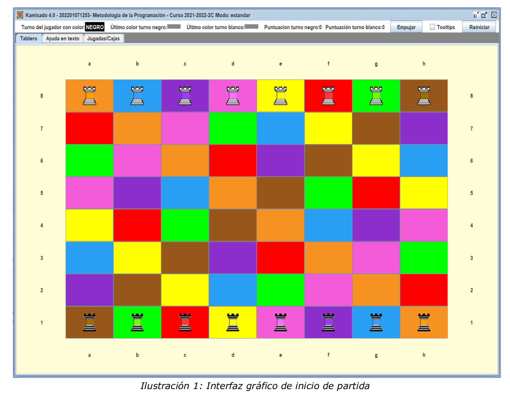

<h1> KAMISADO 4 </h1>

 

`Se continua implementando una variante simplificada del juego Kamisado, incluyendo dos tipos de partida: simple y estándar.
Partiendo de lo realizado en` [KAMISADO](https://github.com/ghiorsiandrea/Kamisado)`, se incluyen además los siguientes conceptos:`

 
 
•Inclusión de una jerarquía de herencia de torres y árbitros (se recomienda revisar el Tema 4.
Herencia de teoría). 
•Inclusión y uso de interfaces y clases genéricas (se recomienda revisar el Tema 5. Generici-
dad de teoría). 
•Inclusión de excepciones comprobables y su lanzamiento con un enfoque defensivo con el consi-
guiente tratamiento de excepciones: comprobables y no comprobables. 
 

`A continuación se repasan las reglas del juego,ya tenidas en cuenta en la anterior versión (Kamisado
3.0), que son las aplicadas en un partida simple, para posteriormente explicar las diferencias en una
partida estándar.`

 

Kamisado es un juego abstracto de tablero de 8x8 celdas, para dos jugadores. Las celdas tienen un
color asignado fijo, de entre solo ocho colores posibles (i.e. amarillo, azul, marrón, naranja, púrpura,
rojo, rosa, y verde). Sobre dicho tablero se colocan 8 torres1 blancas en la fila superior del tablero, y 8
torres negras en la fila inferior del tablero. A partir de ahora diremos que las torres tienen un turno ,
blanco o negro, según corresponda.
A cada jugador, se le asignan sus 8 torres correspondientes. Adicionalmente, cada torre además del
turno (blanco o negro), tiene asignado un color de entre esos ocho. La colocación de las torres de
cada turno, al inicio de la partida, coincide con el color de la celda. Por ejemplo, la torre negra de color
amarillo, se colocará en la fila inferior, en la celda de color amarillo.

 

###                   PARTIDA SIMPLE
(ver Ilustración 1):
 
 

 
 

 

Por simplificacion, siempre comienza la partida el jugador con turno negro. En este primer turno, puede
mover discrecionalmente una de sus torres a otra celda vacía. El color de la celda donde se coloca la to-
rre, determina que en el siguiente turno, el jugador contrario está obligado a mover su torre de dicho
color. 
Por lo tanto, solo es discrecional el primer movimiento de salida. El resto de movimientos están siempre
condicionados por el color de la celda a donde movió en último lugar el jugador contrario.
  
`Los movimientos de las torres están limitados por las siguientes reglas:`
  
•Solo se puede mover una torre del turno actual hacia la fila de inicio del contrario, solo en senti-
do vertical o diagonal (i.e. solo se puede avanzar hacia la fila de partida del contrario, pero
nunca retroceder). 
•No se puede saltar sobre otras torres, independientemente del turno que tengan (ni siquiera
sobre torres propias). 
•No se puede ocupar una celda que contenga otra torre. En este juego no se “comen” o eliminan torres del contrario (ni propias). 
•El jugador con turno está obligado a mover siempre que haya algún movimiento legal. No pue-
de pasar turno. 
La partida simple finaliza en la primera ronda, cuando uno de los jugadores consigue colocar una
de sus torres en la fila de salida del turno contrario sumando 1 punto. A la partidas simple se las
considera de ronda única, finalizando al conseguir un punto.  

Para indicar las celdas del tablero, los jugadores utilizarán la misma notación utilizada en el ajedrez, de -
nominada “notación algebraica”. Por ejemplo y según se muestra en la Ilustración 1, la celda [0][0]
sería "a8", la celda [3][4] sería "e5” y la celda [6][5] sería "f2". Cuando se quiere mencionar una jugada
completa, moviendo una torre de una celda origen a una celda destino, se indicarán las dos celdas segui-
das. Por ejemplo: "a1c3" sería una jugada donde se mueve la torre desde la celda [7][0] a la celda en [5]
[2]. 
Si un jugador está obligado a mover una torre, y dicha torre está bloqueada (según las reglas previas),
se considera que hace un movimiento de “distancia cero”, colocando su torre en la misma celda en la
que estaba, y, por lo tanto, el jugador contrario ahora tendrá que mover su torre del color de dicha cel-
da en la que ha quedado bloqueado el contrario. 
Si se diese la situación de que el bloqueo se da en ambos jugadores, denominado bloqueo mutuo o
deadlock, se considera finalizada, dando como perdedor al jugador que provocó dicha situación con un
movimiento de torre. Es decir, pierde el jugador que hizo el último movimiento que no fuera de “distancia
cero”. 

1 Denominadas también “torres dragón”.

###                   PARTIDA ESTANDAR
 
En esta segunda versión de la KAMISADO, se amplía con la posiblidad de jugar partidas estándar, con va-
rias rondas. 
La partida se inicia igual que una partida simple. En una partida estándar las torres que alcanzan la fila
del contrario suman 1 punto al turno correspondiente y además dicha torre se transforma en una "to-
rre sumo uno" (en algunas versiones del juego se añade un “diente de dragón”), finalizando la ronda
y reiniciando las torres a la posición inicial para iniciar otra ronda. Se colocan de nuevo las torres
en la posición de partida, incluyendo ahora la nueva “torre sumo uno” en su color correspondiente. Inicia
la nueva ronda el turno que perdió la ronda previa. 
Si se alcanza la fila del contrario con una torre sumo uno se consiguen 3 puntos.
Se considera que se finaliza la partida cuando un turno consigue 3 o más puntos, al sumar los pun-
tos acumulados en distintas rondas con torres simples o torres sumo uno.
 

`Las torres sumo uno tienen unas reglas de movimiento adicionales:`
  
•Solo pueden desplazarse un máximo de una distancia de 5 celdas en cualquiera de los sentidos
básicos (vertical o diagonal). 
•Pueden “empujar” una posición hacia delante a torres del contrario que la bloqueen (denominado
“empujón sumo”), pero solo en sentido vertical:  
◦   Solo pueden empujar una torre del turno contrario. 
◦   Detrás de esa torre empujada, debe haber una celda vacía. No se puede “empujar” o echar
torres del turno contrario fuera del tablero. 
◦   No se puede empujar a otra “torre sumo uno” del contrario, solo a una torre simple. 
◦   Cuando se produce un “empujón sumo”, el turno contrario pierde turno y vuelve a mover el
turno que realizó el empujón. 
◦   El color de la torre a mover, tras el empujón, se obtiene del color de la celda donde ha quedado situada la torre del contrario.
  

`La informacion completa acerca del funcionamiento del juego se encuentra en> dsrc/main/java/juego/util/Kamisado_4.0.pdf`

